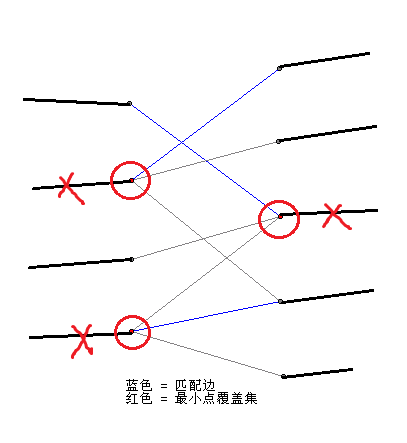

[比赛链接](https://ac.nowcoder.com/acm/contest/885#question)

题目	|A	|B	|C	|D	|E	|F	|G	|H	|I	|J	
-		|-	|-	|-	|-	|-	|-	|-	|-	|-	|-	
通过	|√	|√	|×	|	|	|×	|√	|×	|	|	
补题	|	|	|√	|	|√	|√	|	|√	|	|	

<!--more-->

## A - digits 2

> Solved by nikkukun.

只要输出$n$个$n$就能满足题目要求。

## B - generator 1

> Solved by nikkukun.

按照二进制快速幂需要$\mathcal{O}(n^2)$才能完成，这里可以按照十进制快速幂：

$$A^{10a+b}=(A^a)^{10}\times A^b$$

顺便记录一个我经常会忘记的结论：

$$a^{bc} = a^{b+b+\ldots+b} = (a^b)^c$$

## C - generator 2

> Upsolved by Chielo.

BSGS的模板题。BSGS过程用$\sqrt{p}$分块的话，单次查询就是$\mathcal{O} (\sqrt{p})$的，总时间复杂度是$\mathcal{O} (q\sqrt{p})$，这样会被卡。

我们通过适当调整分块大小，用增加的预处理时间换下降的查询时间。

用$\sqrt{pq}$分块，则单次查询就是$\mathcal{O} (p/\sqrt{pq}) = \mathcal{O} (\sqrt{p/q})$的，总时间复杂度是$\mathcal{O} (\sqrt{pq})$，能够通过。

## E - independent set 1

> Upsolved by nikkukun.

令$f(S)$为集合$S$的最大点独立集，考虑往$S$中加入一个点$u$：

* $u$不属于独立集：$f(S\cup u) = f(S)$；
* $u$属于独立集：$f(S\cup u) = f(S - T) + 1$，其中$T$为与$u$相邻的点；

实际实现的时候，可以枚举状态$S$和$u=\mathrm{lowbit}(S)$，再令`f[S] = max(f[S-u], f[S&(~T[u])]+1)`即可。并不一定需要是`lowbit`，只要是任意一个元素就行。

## F - maximun clique 1

> Upsolved by nikkukun.

原图的最大团等于反图的最大点独立集——因为原图中两两都有边，反图中两两都没边。

因此在两个异或和只有$1$个$1$的两个点间连边，并且可以按照点二进制表示中$1$的奇偶性划分成二分图的两侧，跑最大匹配即可。

根据König定理，我们知道最大匹配 $=$ 最小点覆盖 $=$ 点数 $-$ 最大点独立集，但是怎么构造方案？

考虑一个普通二分图的求最小割过程。这个过程相当于把点映射到连向源汇的边，等效于该问题：删掉二分图中尽可能少的点，使得没有两个点间连边。因此，删掉割边对应的点后，剩余的部分实际上是一个最大点独立集，删掉的点就是最小点覆盖，这就是König定理的内容。

由上述过程，不难找到最大点独立集就是非割边对应的点。如果使用匈牙利算法，则一般采用另一种方法：从$S$集合中没有匹配的点出发，沿着“非匹配$\rightarrow$匹配$\rightarrow$$\ldots$$\rightarrow$匹配”边走，一路标记经过的点，则$S$中所有标记的点，和$T$中未标记的点，都是最大点独立集。可以这么想：$S$中没有匹配的点代表的边一定不在最小割中，因此一定选择；沿着非匹配边到达$T$，则到达的点不能和刚刚的点同时选中，因此不选；再从$T$沿匹配边回到$S$，因为一个匹配中只有一个点被割掉，因此到达的点是需要选择的。如此往复，所有最大独立集中的点都能选上。

更多内容可以参考我之前写的[网络流总结](summary/network-flow/);

## G - subsequence 1

> Solved by Chielo.

记录一下长度为$i$且是否等于$T$的序列个数，然后转移就很好写了。

## H - subsequence 2

> Upsolved by nikkukun.

将每个给定的序列字母标号，然后看是否有长度为$n$的拓扑序即可。

一个可能的坑点：有数据输入空串，此时读入`string`是会出问题的……
